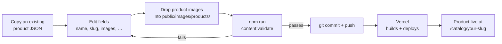
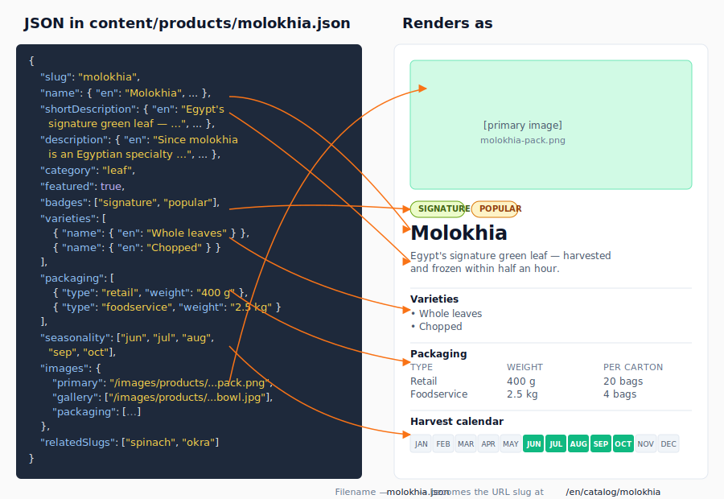

# Add or update a product

A product is one JSON file under `content/products/`. After you save and push, Vercel rebuilds the site and the new product appears in the catalog.

## The flow at a glance



## What ends up on the page

Each field in the product JSON drives a specific element on the rendered product page. Use this as a reference when filling in step 2 below.



## Prerequisites

- Git installed; you can push to the `main` branch.
- Node 20+ and `npm install` already run once.
- Product photos ready (at least one main image, ideally also a lifestyle/in-pack shot).

## Steps

1.  **Copy an existing product as a template.** From the `web/` folder:

    ```bash
    cp content/products/molokhia.json content/products/your-new-product.json
    ```

    The filename (minus `.json`) becomes the URL slug: `your-new-product` → `/catalog/your-new-product`.

2.  **Open the new file** in your editor and edit the fields. The shape is:

    ```json
    {
      "slug": "your-new-product",
      "name":             { "en": "Your Product", "ar": "…", "fr": "…" },
      "shortDescription": { "en": "One-line summary.", "ar": "…", "fr": "…" },
      "description":      { "en": "Long description.", "ar": "…", "fr": "…" },
      "category": "leaf",
      "featured": false,
      "badges": ["popular"],
      "varieties":   [ { "name": { "en": "Whole", "ar": "…", "fr": "…" } } ],
      "packaging":   [ { "type": "retail", "weight": "400 g", "perCarton": "20 bags" } ],
      "seasonality": ["jun", "jul", "aug"],
      "images": {
        "primary":   "/images/products/your-new-product-pack.png",
        "gallery":   ["/images/products/your-new-product-bowl.jpg"],
        "packaging": ["/images/products/your-new-product-pack.png"]
      },
      "relatedSlugs": ["molokhia", "spinach"]
    }
    ```

    Every field, required vs optional, and allowed values: [content-schemas.md](../reference/content-schemas.md#product).

3.  **Add the product images** to `public/images/products/`. Keep filenames lowercase, hyphenated, and matching the paths in the JSON. Recommended sizes:

    - **Primary** (the main pack/product shot): 1200 × 1200 px PNG with transparent background, or JPG
    - **Gallery** (bowl/lifestyle/in-use shots — one or more): 1600 × 1200 px JPG
    - **Packaging** (retail/foodservice pack photos — one or more): 1200 × 1600 px PNG with transparent background

4.  **Validate the content.** From `web/`:

    ```bash
    npm run content:validate
    ```

    Expected output ends with `✓ All content valid`. If you see errors like `Required at "name.ar"`, the schema is telling you a translation is missing — go back to step 2.

5.  **Commit and push.**

    ```bash
    git add content/products/your-new-product.json public/images/products/your-new-product*.*
    git commit -m "content: add product 'your new product'"
    git push origin main
    ```

6.  **Wait for the build.** Open Vercel → Deployments. A new build will appear within ~30 seconds. It takes 2–4 minutes to finish.

## Verify it worked

- Visit `https://montanaeg.com/catalog/your-new-product` — the page should load with images.
- Visit `https://montanaeg.com/catalog` — the new product card appears in the grid.
- Visit the Arabic and French versions too: `/ar/catalog/your-new-product`, `/fr/catalog/your-new-product`.

## Rollback

If the product looks broken in production:

```bash
git revert HEAD                 # makes a new commit that undoes the last
git push origin main            # Vercel rebuilds; product disappears in 3–4 min
```

To fix instead of remove: edit the JSON again, commit, push.

## Troubleshooting

- **`content:validate` fails with `Required`** — A required field is missing. The error names the path (e.g., `varieties.0.name.fr`).
- **Build fails on Vercel** — Almost always a validation error that wasn't caught locally. See [runbooks/build-failed-on-vercel.md](../runbooks/build-failed-on-vercel.md).
- **Image shows as a broken icon** — The file path in the JSON doesn't match the filename on disk. Both must be lowercase. Check spelling.
- **Product appears in English but not Arabic** — A translation field was left blank. Re-validate; the schema catches missing translations.

## Related

- [Update translations](update-translations.md) for shared UI strings.
- [Edit page content](edit-page-content.md) for category descriptions on the catalog page.
- [Content schemas reference](../reference/content-schemas.md) for every field.
