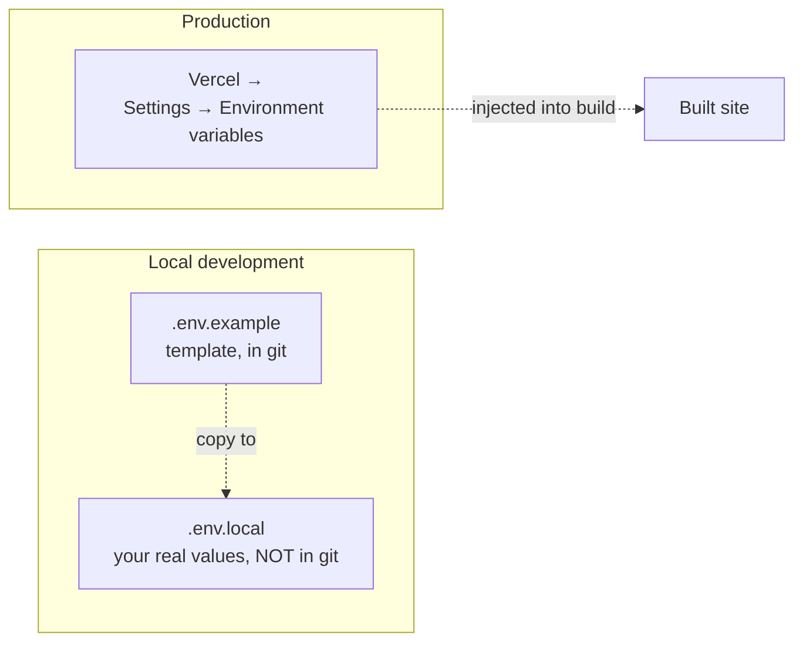
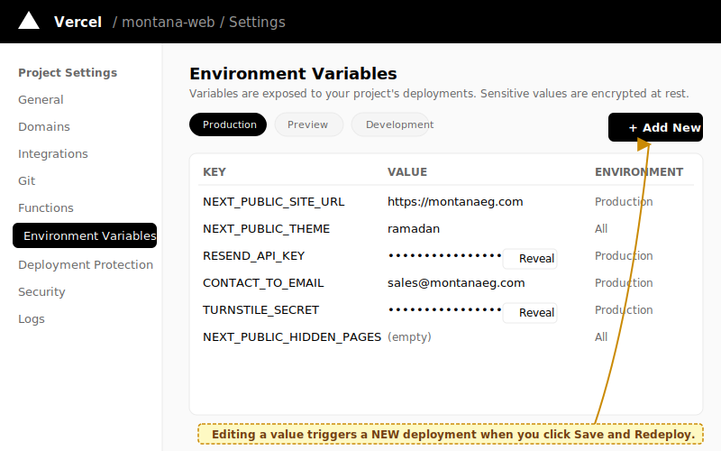

# Change an environment variable

Environment variables control feature toggles, API keys, and configuration that should not live in code. Production env vars live in the **Vercel dashboard**, never in a file in the repo.

## Where env vars live



| Where | What | Used by |
| --- | --- | --- |
| `.env.example` | Template — names and dummy values only | Documentation for IT and devs |
| `.env.local` | Real values for local development. Gitignored. | `npm run dev` on your machine |
| Vercel → Settings → Environment variables | Real values for the **live site**. Production and Preview tabs. | `npm run build` running on Vercel |

The full catalog of vars (name, purpose, default, who needs it) is in [env-vars.md](../reference/env-vars.md). Look there first if you're not sure which variable controls what you want to change.

## Prerequisites

- Vercel dashboard access.
- The new value ready (API key, boolean, URL, etc.).
- If rotating a secret (key/token), the new credential issued and the old one ready to revoke after verification.

## Steps — change a production env var

1.  **Log in** at <https://vercel.com>.

2.  **Open the project** → **Settings** → **Environment variables**.

    
    > _Illustration. Replace with a real screenshot when you next visit this screen — see [`docs/_images/README.md`](../_images/README.md)._

3.  **Switch to the Production tab** (top of the env-vars panel). Don't edit Preview unless that's specifically what you want.

4.  **Find the variable** by name, or click **Add variable** if it doesn't exist yet.

5.  **For secrets** (anything with a key, secret, token, or password) — click the **Encrypt** checkbox so the value is masked. For `NEXT_PUBLIC_*` variables, leave it unencrypted — they're public anyway.

6.  **Enter the new value.** Be exact:
    - No surrounding quotes.
    - No trailing whitespace.
    - For booleans, use the literal string `true` or `false`.
    - For empty (disable the feature), leave the value blank — don't put `""` or `null`.

7.  **Click Save.**

8.  **Trigger a redeploy.** Env var changes do not auto-rebuild. Either:
    - **Vercel:** Deployments tab → three-dot menu on latest production deploy → **Redeploy**.
    - **Git:** Push an empty commit:
      ```bash
      git commit --allow-empty -m "chore: redeploy after env var change"
      git push origin main
      ```

9.  **Wait 2–4 minutes** for the build to finish.

## Steps — change a local env var

For local development only (running `npm run dev` on your laptop):

1.  Open `.env.local` _(create it from `.env.example` if it doesn't exist):_

    ```bash
    cp .env.example .env.local
    ```

2.  Edit the value.

3.  **Restart the dev server** — env vars are read at startup:

    ```bash
    # Stop the dev server (Ctrl-C in the terminal where it's running)
    npm run dev
    ```

Your `.env.local` is gitignored — it will never be pushed to the repo.

## Verify

- For `NEXT_PUBLIC_*` vars _(client-facing — feature flags, theme, locales)_: visit the live site and confirm the change. Hard-refresh.
- For server-only vars _(Resend, Turnstile, etc.)_: trigger the feature (submit a contact form, etc.) and confirm it behaves as expected. Check Next.js API routes logs if needed.

## Rollback

In the dashboard, set the variable back to its previous value and retry the deployment. There's no "history" of env-var values — write down the old value before changing it if you might need it.

## NEXT_PUBLIC_… vs other vars

There are **two classes** of env var:

| Prefix | Visibility | Examples |
| --- | --- | --- |
| `NEXT_PUBLIC_…` | **Baked into the JavaScript** that visitors download. Anyone can see these by viewing page source. Use for non-secrets only (theme name, feature flags, public site URLs). | `NEXT_PUBLIC_THEME`, `NEXT_PUBLIC_SITE_URL` |
| No prefix | **Server-only**, used by Next.js API routes (e.g., the contact form). Never sent to the browser. Use for API keys and secrets. | `RESEND_API_KEY`, `TURNSTILE_SECRET` |

**Never put a secret in a `NEXT_PUBLIC_…` variable.** It will be visible in the page source on the live site.

## Troubleshooting

- **Variable doesn't take effect after redeploy** — Confirm you edited Production, not Preview. Confirm the build finished (Deployments tab).
- **`NEXT_PUBLIC_…` var still shows old value after change** — Browser cache. Hard-refresh, then try a private window.
- **Site breaks after change** — Did you set the variable to an invalid value? Rollback to the old value, then look at the build log.
- **I committed `.env.local` by accident** — If it had real credentials, **rotate every key in it immediately**, then remove from git history. Then add a stricter pre-commit check.

## Related

- [Environment variables reference](../reference/env-vars.md) — every variable, what it does.
- [Switch theme](switch-theme.md) — uses `NEXT_PUBLIC_THEME`.
- [Set up contact form](set-up-contact-form.md) — uses `RESEND_API_KEY` and Turnstile vars.
