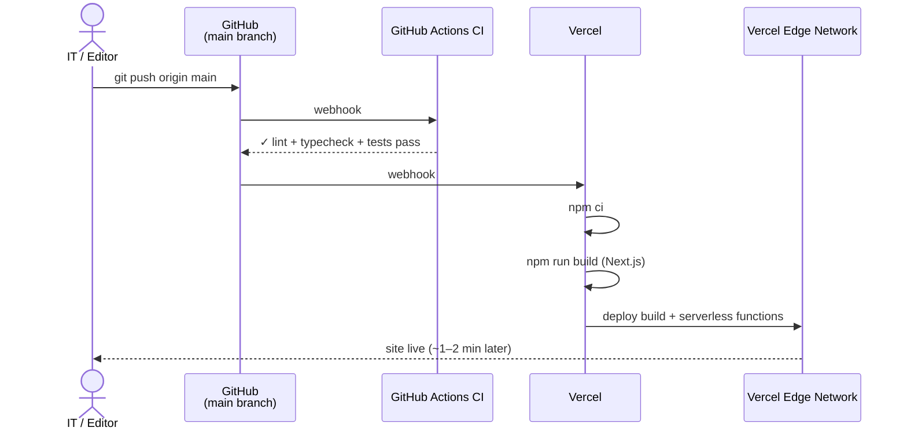
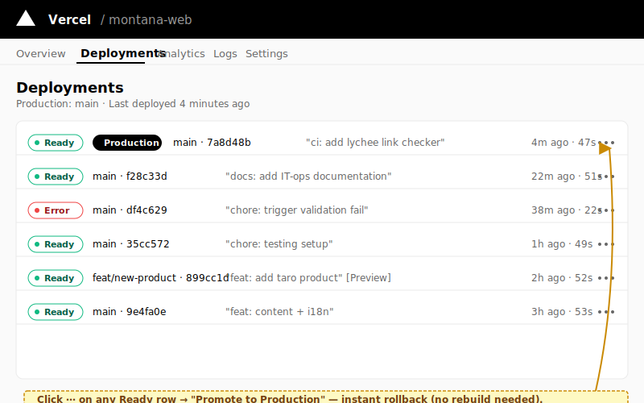

# Deploy to Vercel

Day-to-day, you do **not deploy manually** — pushing to the `main` branch automatically triggers a Vercel build. The site goes live ~1–2 minutes later. This guide covers the normal flow and the cases where you act directly in the Vercel dashboard.

## Normal deploy flow



If CI fails (red ✗ on the commit in GitHub), Vercel still builds — they're independent. If the Vercel build also fails, the **previous deploy keeps serving** as Production — so a bad push never breaks the live site.

## Build settings (reference)

Configured once when the project was imported. You should not need to change these.

| Setting | Value |
| --- | --- |
| Framework Preset | Next.js (auto-detected) |
| Build Command | `npm run build` |
| Install Command | `npm ci` |
| Output Directory | `.next` (default for Next.js — set automatically) |
| Node version | 20.x (set via `engines.node` in `package.json`) |
| Production Branch | `main` |
| Root Directory | `web/` if the repo root is the `Montana/` parent, otherwise `/` |
| Region | `fra1` (Frankfurt — closest to Egypt) |

`vercel.json` in the repo pins the framework, install command, and region, and sets security headers.

## Steps — push to deploy (the normal case)

1.  Make your change (edit content, swap an image, etc.).

2.  Commit:

    ```bash
    git add <files>
    git commit -m "short description"
    ```

3.  Push:

    ```bash
    git push origin main
    ```

4.  Watch the build:

    - **GitHub:** open your commit. The yellow dot becomes a green check (CI passed) or red X (CI failed).
    - **Vercel:** open <https://vercel.com> → your project → **Deployments**. The new build appears within ~10s, status moves through **Queued → Building → Ready**.

    
    > _Illustration of the Deployments view. The latest Ready row carries the Production badge._

5.  When the build is Ready, the new site is live on Vercel's global edge.

## Steps — trigger a deploy without a code change

Use this after changing an env var, or to retry a previous build.

1.  **Push an empty commit:**

    ```bash
    git commit --allow-empty -m "chore: redeploy"
    git push origin main
    ```

    _OR_

2.  **Redeploy from the dashboard:** Deployments → three-dot menu on the latest Production deploy → **Redeploy** → check **Use existing Build Cache** (faster).

## Steps — rollback to a previous deploy

If the live site is broken and you need to revert **immediately** (faster than pushing a fix):

1.  **Vercel → your project → Deployments.**
2.  Find the **last Ready deploy** on the `main` branch _(scroll past the broken one)_.
3.  **Three-dot menu → Promote to Production.**
4.  Confirm. The previous build is promoted within **seconds** — no rebuild needed (it's already built and cached at the edge).

This is the fastest rollback path on Vercel — measured in **seconds**, not minutes. Use it for incidents.

After the rollback, fix the issue in code and push a new commit normally.

## Preview deployments

Every **pull request** to `main` automatically gets a unique preview URL like `https://montana-web-<branch>-<team>.vercel.app`. Vercel posts the URL as a comment on the PR. Use these to review big content changes before merging.

Preview deployments use the **Preview** environment variables — distinct from Production. Set them separately if your preview needs different values (e.g., a test Resend domain).

## Verify a deploy worked

- Deployments tab shows the new entry as **Ready** with a green check.
- The **Production** badge moves from the previous deploy to the new one.
- Visit <https://montanaeg.com> and confirm your change (hard-refresh if not).
- Smoke check: homepage loads, language switcher works, contact form visible.

## Custom domain

`montanaeg.com` (apex) and `www.montanaeg.com` (redirects to apex) are served by Vercel; DNS is managed at **Cloudflare** (the Cloudflare zone stays — only the build/host moved). If you're moving the domain or changing DNS, that's a one-time engineering task, not routine ops.

Verification: in Vercel → Settings → Domains, both records should show "Valid Configuration".

## Troubleshooting

- **Push succeeded but no build triggered** — Make sure the push went to `main`. Check Vercel → Settings → Git → that the GitHub integration is healthy.
- **Build is stuck "Building" >5 minutes** — Cancel from the deploy menu and **Redeploy**. Normal builds are 1–2 minutes. Stuck builds usually mean a Vercel infrastructure issue; check <https://www.vercel-status.com>.
- **Build failed** — Open the build log. Usually a content validation error. See [build-failed-on-vercel.md](../runbooks/build-failed-on-vercel.md).
- **Build succeeds but site shows old content** — Edge / browser cache. Hard-refresh. If still stale after ~5 min, in Vercel → Deployments → three-dot → **Purge Data Cache**.

## Related

- [Build failed on Vercel](../runbooks/build-failed-on-vercel.md)
- [Site is down](../runbooks/site-down.md)
- [Change an environment variable](change-environment-variable.md) — env-var changes don't auto-rebuild.
