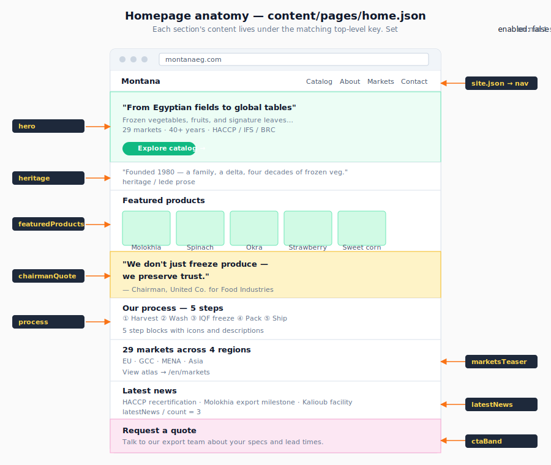

# Edit page content

The big pages (Home, About, Catalog, Contact, Markets, News) each have a JSON file under `content/pages/` that holds their copy — headlines, intros, feature blurbs, calls-to-action. Edit the JSON; the page rebuilds.

## Page → file map

| Page | URL | Content file |
| --- | --- | --- |
| Home | `/` | `content/pages/home.json` |
| About | `/about` | `content/pages/about.json` |
| Catalog | `/catalog` | `content/pages/catalog.json` |
| Markets | `/markets` | `content/pages/markets.json` |
| Contact | `/contact` | `content/pages/contact.json` |
| News | `/news` | `content/pages/news.json` |

Site-wide values (brand name, address, social links, certifications, footer copy) live in [`content/site.json`](../../content/site.json). Edit that file for anything that appears in the header or footer.

## Which JSON key drives which section?

Each page JSON is structured by section. The illustration below maps the homepage sections to their JSON keys — the other pages follow the same pattern (look at the matching `content/pages/<page>.json` file's top-level keys).



Most sections support `enabled: false` to hide them without removing the content — useful for staged launches.

## Prerequisites

- Git installed; push access to `main`.
- The new copy in all three languages (EN / AR / FR).

## Steps

1.  **Find the page file** using the table above. Open it in your editor.

2.  **Locate the field** you want to change. Fields are nested by section. Example from `home.json`:

    ```json
    {
      "hero": {
        "headline":    { "en": "From Egyptian fields…", "ar": "…", "fr": "…" },
        "subheadline": { "en": "…", "ar": "…", "fr": "…" },
        "cta": {
          "label": { "en": "Explore catalog", "ar": "…", "fr": "…" },
          "href":  "/catalog"
        }
      },
      "features": [ … ]
    }
    ```

3.  **Update the copy in all three languages.** If you only have English, copy the English text into the `ar` and `fr` keys as a temporary fallback — the page will work, but the Arabic and French versions will show English. Better to translate before pushing.

4.  **Validate the content.**

    ```bash
    npm run content:validate
    ```

5.  **Preview locally** _(optional but recommended for big edits)_:

    ```bash
    npm run dev
    # → http://localhost:3000
    ```

    Open the page you edited and confirm it looks right in all three languages: `/`, `/ar`, `/fr`.

6.  **Commit and push.**

    ```bash
    git add content/pages/<file>.json
    git commit -m "content: update <page name> copy"
    git push origin main
    ```

7.  **Wait 2–4 minutes** for the build.

## Verify

- Visit the live page and any locale variants.
- Check the page renders without layout breaks (very long headlines can wrap awkwardly — shorten if so).

## Rollback

```bash
git revert HEAD
git push origin main
```

Or simply edit the JSON back to the previous text and push again.

## Editing site-wide values

For anything in the **header, footer, or that appears on every page** (brand name, address, phone, social links, certifications, copyright):

1. Open `content/site.json`.
2. Find the section: `brand`, `contact`, `social`, `certifications`, `footer`.
3. Edit and validate as above.

Example: changing the company phone number:

```json
{
  "contact": {
    "phone": "+20 2 1234 5678",
    "email": "info@montanaeg.com",
    "address": { "en": "Kalioub, Egypt", "ar": "…", "fr": "…" }
  }
}
```

## Troubleshooting

- **My edit doesn't show up after push** — Check the Vercel build finished (Deployments tab) and your browser cache (`Cmd-Shift-R` to hard refresh).
- **`content:validate` says "Expected string, received undefined"** — A field name is misspelled, or you deleted a required field.
- **The page layout broke** — Likely a very long string or invalid HTML/Markdown in the copy. Look at the page in dev (`npm run dev`); shorten the offending text.

## Related

- [Update translations](update-translations.md) for buttons, nav, and other shared UI strings.
- [Content schemas](../reference/content-schemas.md) — the field-by-field shape of each page file.
