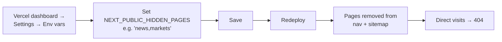

# Show or hide a page in the nav and sitemap

Top-level pages can be hidden without deleting them. The `NEXT_PUBLIC_HIDDEN_PAGES` env var takes a comma-separated list of page IDs; listed pages disappear from the nav, the sitemap, and return 404 if visited directly.

## Hideable pages

| ID | URL | Notes |
| --- | --- | --- |
| `home` | `/` | Don't hide this. |
| `about` | `/about` | |
| `catalog` | `/catalog` | Hides the entire product catalog. |
| `news` | `/news` | Hides the newsroom; existing articles also become unreachable. |
| `markets` | `/markets` | |
| `contact` | `/contact` | Use with care — visitors lose the contact form. |

The legal pages (`/privacy`, `/terms`, `/cookies`) are **not** in this list — they're always visible because the cookie banner and footer link to them.

## The flow



## Prerequisites

- Vercel dashboard access.

## Steps

1.  **Decide which pages to hide.** Use the IDs from the table above.

2.  **Open Vercel → your project → Settings → Environment variables → Production tab.**

3.  **Find or add `NEXT_PUBLIC_HIDDEN_PAGES`.**

4.  **Set the value** to a comma-separated list, no spaces:

    ```
    news,markets
    ```

    To show **all pages**, leave the value blank or delete the variable.

5.  **Click Save.**

6.  **Retry the latest production deployment** (Deployments tab → three-dot menu → Redeploy).

7.  **Wait 2–4 minutes.**

## Verify

- Open the live site. Hidden pages no longer appear in the top nav (desktop) or hamburger menu (mobile).
- Visit a hidden URL directly (e.g., `https://montanaeg.com/news`) — should return 404.
- Open `https://montanaeg.com/sitemap.xml` — hidden pages should be absent.
- All three locales should respect the rule (`/`, `/ar`, `/fr`).

## Rollback / unhide

Remove the page ID from the `NEXT_PUBLIC_HIDDEN_PAGES` list. Save. Retry the deployment. The page reappears in 2–4 minutes.

To show **every** page, set the value to empty string (or delete the variable entirely).

## When to use this

- **Page not ready for launch yet** (newsroom with no articles, markets page mid-overhaul) — hide it, finish it, unhide.
- **Temporary takedown** for legal / compliance / content review.
- **Localized launch** — combine with [`NEXT_PUBLIC_AVAILABLE_LOCALES`](../reference/env-vars.md) to launch one locale at a time.

For a longer-term takedown, consider editing the page content to a "coming soon" state instead — that way the URL still resolves and any external links to it don't break.

## Troubleshooting

- **Page still shows after redeploy** — Spelling. The IDs in `NEXT_PUBLIC_HIDDEN_PAGES` are case-sensitive. Use exactly `home`, `about`, `catalog`, `news`, `markets`, `contact`.
- **Hidden page returns 200 instead of 404** — Vercel edge cache. Hard-refresh, or wait 5 minutes for the edge cache to clear.
- **Build fails after I set the var** — Check the value. Trailing/leading whitespace or quotes around the value can break the parser. Just plain `news,markets`.

## Related

- [Change an environment variable](change-environment-variable.md) — the underlying procedure.
- [Environment variables reference](../reference/env-vars.md) — `NEXT_PUBLIC_HIDDEN_PAGES` in context.
