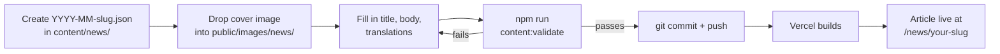
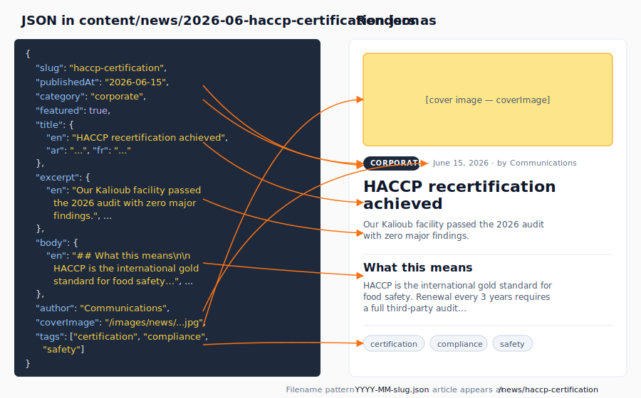

# Publish a news article

News articles live as JSON files under `content/news/`. Each file is one article. The newsroom page lists them in reverse chronological order, automatically.

## The flow



## What ends up on the page

Each field in the article JSON drives a specific element on the rendered article page.



## Prerequisites

- Git installed; push access to `main`.
- The article in EN, AR, and FR. _(English-only is allowed but discouraged — the missing-language fields fall back to English.)_
- A cover image (1600 × 900 px JPG, kept under 300 KB).

## Steps

1.  **Pick a filename.** Convention: `YYYY-MM-slug.json` (year and month from publication date). Example: `2026-06-new-export-market.json`. The slug after the date becomes the URL: `/news/new-export-market`.

2.  **Create the file** by copying an existing article:

    ```bash
    cp content/news/haccp-certification.json content/news/2026-06-your-slug.json
    ```

3.  **Edit the file.** Required shape:

    ```json
    {
      "slug": "your-slug",
      "publishedAt": "2026-06-15",
      "category": "company",
      "title": { "en": "…", "ar": "…", "fr": "…" },
      "excerpt": { "en": "…", "ar": "…", "fr": "…" },
      "body": { "en": "Markdown allowed.", "ar": "…", "fr": "…" },
      "author": "Communications",
      "coverImage": "/images/news/your-cover.jpg",
      "tags": ["export", "milestone"]
    }
    ```

    - `slug` **must** match the filename (without `.json`).
    - `featured: true` promotes the article into the **featured slideshow at the top of the `/news` page**. Flag as many as you like — they rotate automatically (newest first), with prev/next + dots and a "View all featured" button that stacks them all at once. Flag exactly one for a single static hero; flag none and no hero shows (all articles appear in the grid).
    - `homepage: true` (optional) opts the article into the **"From the newsroom" section on the home page**. Flag as many as you like — the home section shows the newest opted-in articles up to its configured `count` (set in `content/pages/home.json` → `latestNews.count`, currently 6, max 12). If _no_ article is flagged, the section falls back to the most recent articles automatically. This is independent of `featured`.
    - `publishedAt` controls sort order; **future dates do not hide the article** — the page will publish immediately. If you want to schedule, push later.
    - `body` accepts Markdown (headings, lists, links, **bold**, _italic_).

    Full schema: [content-schemas.md#news](../reference/content-schemas.md#news).

4.  **Add the cover image** to `public/images/news/` (create the folder if it doesn't exist).

5.  **Validate.**

    ```bash
    npm run content:validate
    ```

    Look for `✓ All content valid`.

6.  **Commit and push.**

    ```bash
    git add content/news/2026-06-your-slug.json public/images/news/your-cover.jpg
    git commit -m "news: publish 'short title here'"
    git push origin main
    ```

7.  **Wait 1–2 minutes** for Vercel to rebuild.

## Verify

- Visit `https://montanaeg.com/news` — your article appears at the top of the list.
- Visit `https://montanaeg.com/news/your-slug` — full article renders.
- Check the AR and FR locales too (`/ar/news/your-slug`, `/fr/news/your-slug`).

## Rollback

```bash
git revert HEAD
git push origin main
```

To merely unpublish without removing the article entirely: rename the file to start with an underscore (`_2026-06-your-slug.json`) — it'll be ignored by the content loader. Push. _(This is a soft-delete; the file stays in git history.)_

## Troubleshooting

- **`content:validate` complains about `publishedAt`** — must be `YYYY-MM-DD`, not `MM/DD/YYYY`.
- **Article renders but body is empty** — Markdown inside JSON requires escaped newlines (`\n`) or use one long line. Easier: keep body short and store long-form prose in a separate Markdown file _(not currently wired — see engineering)_.
- **Hyperlinks in body show as text** — Use standard Markdown: `[link text](https://example.com)`. JSON strings must escape any inner quotes: `\"`.

## Related

- [Add a product](add-product.md) — similar workflow.
- [Edit page content](edit-page-content.md) — for the newsroom page's own copy (subtitle, intro).
