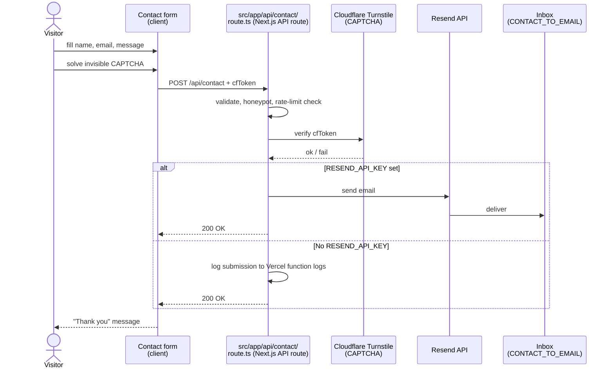
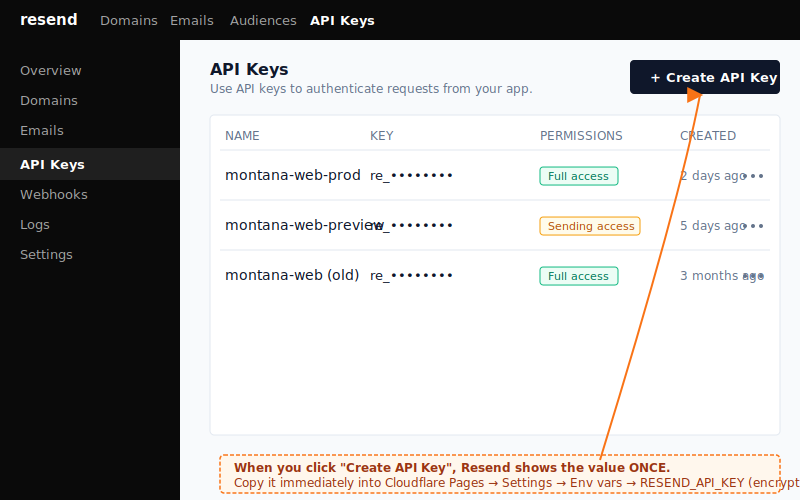
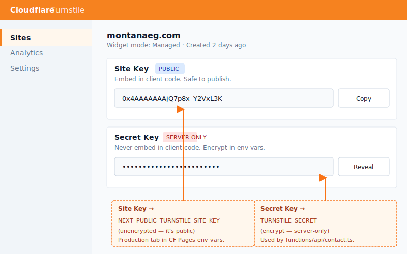

# Set up the contact form

The contact form is the one piece of dynamic functionality on the site. It uses a Next.js API route to verify a CAPTCHA and send email via Resend. Without configuration it still works for local testing — submissions are logged to the Vercel function logs.

## End-to-end flow



## Required services

You need three things to enable real email delivery:

| Service | What it does | Cost |
| --- | --- | --- |
| [Resend](https://resend.com) | Sends the email | Free tier covers <3K emails/month |
| [Cloudflare Turnstile](https://dash.cloudflare.com/?to=/:account/turnstile) | Invisible CAPTCHA, blocks bots | Free |
| Your existing inbox | Receives messages | — |

## Prerequisites

- Vercel dashboard access (for env vars).
- A Resend account.
- A verified sender domain in Resend (`montanaeg.com` or similar).
- ~15 minutes.

## Steps — set up Resend (mail delivery)

1.  **Create an account** at <https://resend.com>.

2.  **Add and verify your domain.** Resend → **Domains → Add Domain → `montanaeg.com`**. Resend gives you DNS records (TXT, MX, DKIM) — add them to your DNS provider (Cloudflare DNS, since the domain is on Cloudflare). Wait for verification (a few minutes typically).

3.  **Create an API key.** Resend → **API Keys → Create API Key**. Name it `montana-web-prod`. Copy the key immediately — Resend only shows it once.

    
    > _Illustration. When replacing with a real screenshot, **mask the key value first.**_

4.  **In Vercel, add three env vars** (Production tab; encrypt all three):

    ```
    RESEND_API_KEY     = re_xxxxxxxxxxxxxxxx
    CONTACT_FROM_EMAIL = noreply@montanaeg.com    # must be at the verified domain
    CONTACT_TO_EMAIL   = sales@montanaeg.com      # where messages arrive
    ```

    Optional:

    ```
    CONTACT_CC_EMAIL   = manager@montanaeg.com    # blind-CC a manager
    RESEND_REGION      = eu-west-1                # nearest to Egypt
    ```

5.  **Save**, then redeploy (Deployments → Retry, or push an empty commit).

## Steps — set up Turnstile (CAPTCHA)

Without Turnstile, the form still works but is wide open to spam.

1.  **Cloudflare dashboard → Turnstile → Add Site.** Use:

    - **Site Name:** `montanaeg.com`
    - **Domain:** `montanaeg.com`
    - **Widget Mode:** Managed (lets Cloudflare decide invisible/visible challenge)

2.  Cloudflare gives you a **Site Key** (public) and **Secret Key** (server-only).

    
    > _Illustration. When replacing with a real screenshot, **mask the secret key first.**_

3.  **In Vercel, add two env vars:**

    ```
    NEXT_PUBLIC_TURNSTILE_SITE_KEY = 0x4AAAAA…    # public, unencrypted
    TURNSTILE_SECRET               = 0x4AAAAA…    # encrypt
    ```

4.  **Save**, then redeploy.

## Verify

1.  Visit `https://montanaeg.com/contact`.
2.  Fill the form and submit. You should see a "Thank you" confirmation.
3.  Check the inbox at `CONTACT_TO_EMAIL` — the message arrives within ~30 seconds.
4.  In Vercel → **Functions → Real-time Logs**, you should see a `POST /api/contact` log line with status 200.

If you set up only Turnstile but not Resend: the form will appear to work but no email will arrive. Submissions are logged to Vercel function logs instead — useful for testing.

## Rate limiting

The Function has a rate limit placeholder of `CONTACT_RATE_LIMIT_PER_HOUR=5` per IP. **Currently, the limit is wired but enforcement requires Vercel KV (or external store)** — this is a known engineering follow-up. Until then, the limit is informational; spam protection relies on Turnstile + the honeypot field.

## Rotate the Resend API key

If a key is compromised or you're rotating on schedule:

1.  Resend → API Keys → **Create API Key** (new one), copy the value.
2.  Vercel → env vars → update `RESEND_API_KEY` to the new value, save, redeploy.
3.  Test by submitting the form.
4.  Once verified, Resend → API Keys → **revoke the old key**.

Same approach applies to rotating the Turnstile secret.

## Maintenance mode

If you need to **temporarily disable** the form during an incident: in Vercel env vars, set `RESEND_API_KEY` to empty. Form continues to display and accept submissions, but they go to Vercel function logs only — no spam to your inbox. Restore the key when ready.

## Troubleshooting

- **Submissions go through but no email arrives** — Check Resend → Logs for the request. Most common cause: `CONTACT_FROM_EMAIL` doesn't match a verified domain in Resend. Or the email is in spam — check the recipient's spam folder.
- **Form returns 403 / "Verification failed"** — Turnstile is rejecting the token. Either `TURNSTILE_SECRET` is wrong or `NEXT_PUBLIC_TURNSTILE_SITE_KEY` is from a different Turnstile site.
- **Form returns 500** — Function error. Check **Vercel → Functions → Real-time Logs**. See [contact-form-not-delivering runbook](../runbooks/contact-form-not-delivering.md).
- **"Submission rate exceeded"** — Rate limit hit. _(Once KV is wired in.)_
- **CAPTCHA visible / blocking real users** — Turnstile widget mode should be **Managed**, not **Always Challenge**. Reconfigure in Turnstile dashboard.

## Related

- [Contact form not delivering runbook](../runbooks/contact-form-not-delivering.md)
- [Change an environment variable](change-environment-variable.md)
- [Environment variables reference](../reference/env-vars.md) — contact-form section.
