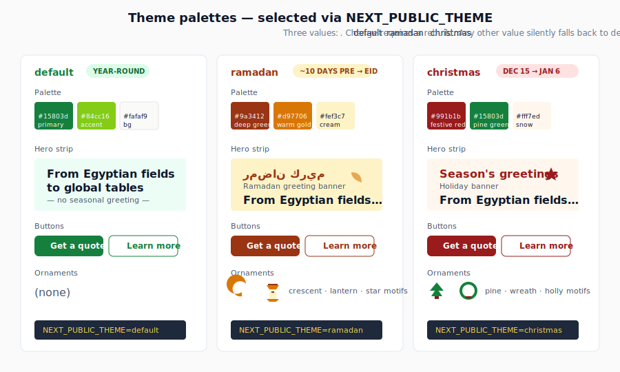
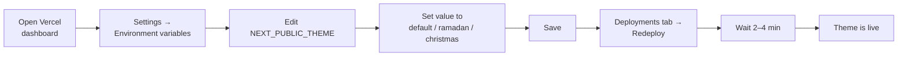

# Switch the seasonal theme

The site supports three themes: **default**, **ramadan**, and **christmas**. The theme is selected by one environment variable: `NEXT_PUBLIC_THEME`. Changing it requires a rebuild — there's no runtime switch.

## What each theme changes

| Theme | Greeting | Color accents | Ornaments | Typical use |
| --- | --- | --- | --- | --- |
| `default` | None | Brand greens | None | Year-round (default) |
| `ramadan` | Ramadan Kareem | Warm gold + deep green | Crescent + lanterns | ~10 days before Ramadan → end of Eid |
| `christmas` | Seasonal | Festive red + green | Pine + wreath motifs | Mid-December → early January |

The greeting is the small banner that appears at the top of the homepage. It can be hidden by setting `NEXT_PUBLIC_THEME_GREETING_ENABLED=false`.

## What each theme looks like

## The flow

## Prerequisites

- Vercel account with access to the project.
- Know what date range you want the theme active for (you have to manually switch back when the season ends).

## Steps

1.  **Log in to Vercel** at <https://vercel.com>.

2.  **Open the project** (`montana-web` or whatever it's named in your account) → click **Settings**.

    
    > _Illustration. Replace with a real screenshot when convenient — see [`docs/_images/README.md`](../_images/README.md)._

3.  **Click "Environment variables"** in the sidebar.

4.  **Find or add `NEXT_PUBLIC_THEME`** under the **Production** tab. If it doesn't exist yet, click **Add variable** and use the variable name exactly: `NEXT_PUBLIC_THEME` (case-sensitive).

5.  **Set the value** to one of:

    - `default`
    - `ramadan`
    - `christmas`

    Any other value (typo, capitalization mismatch) silently falls back to `default`.

6.  **Click Save.**

7.  **Trigger a redeploy.** Vercel does **not** auto-rebuild on env-var changes. Two options:

    - **Vercel-only:** Go to **Deployments**, click the three-dot menu on the latest production deploy, choose **Redeploy**.
    - **Via git** _(also valid):_ Push any commit to `main` (even an empty one: `git commit --allow-empty -m "chore: switch to ramadan theme"`). Vercel will rebuild.

8.  **Wait 2–4 minutes** for the build to finish.

## Verify

- Open <https://montanaeg.com>.
- The seasonal greeting appears at the top _(unless `NEXT_PUBLIC_THEME_GREETING_ENABLED=false`)_.
- Colors and ornaments on the homepage hero have shifted to match the theme.
- Check on mobile — the theme touches mobile and desktop equally.

If you don't see a change, hard-refresh (`Cmd-Shift-R`). If still nothing, see [Troubleshooting](#troubleshooting).

## Rollback

Set `NEXT_PUBLIC_THEME` back to `default` and retry the deployment. Same steps as above.

## Toggle just the greeting banner

To keep the seasonal **colors and ornaments** but hide the greeting banner:

1. In Vercel env vars, set `NEXT_PUBLIC_THEME_GREETING_ENABLED=false`.
2. Save, retry deployment.

## Troubleshooting

- **No change after redeploy** — Make sure you edited the **Production** environment, not Preview. Make sure you actually clicked Save.
- **Build fails after I set the var** — The variable itself shouldn't cause a build failure. Check the build log (see [build-failed runbook](../runbooks/build-failed-on-vercel.md)).
- **Theme partially applies** — Browser cache. Hard-refresh, or test in a private/incognito window.
- **Greeting banner has the wrong text** — Greeting text comes from `messages/<locale>.json` under `themeGreeting`. See [update-translations.md](update-translations.md).

## When to switch each theme (calendar guide)

- **Ramadan** — Switch ~10 days before Ramadan begins; switch back the day after Eid al-Fitr ends.
- **Christmas** — Switch from **December 15** to **January 6** (Coptic Christmas).
- **Default** — Everything else.

These dates are operational guidance, not technical constraints; you can keep a theme on whenever you want.

## Related

- [Change an environment variable](change-environment-variable.md) — the general procedure for any env var.
- [Environment variables reference](../reference/env-vars.md) — `NEXT_PUBLIC_THEME` and `NEXT_PUBLIC_THEME_GREETING_ENABLED` in context.
