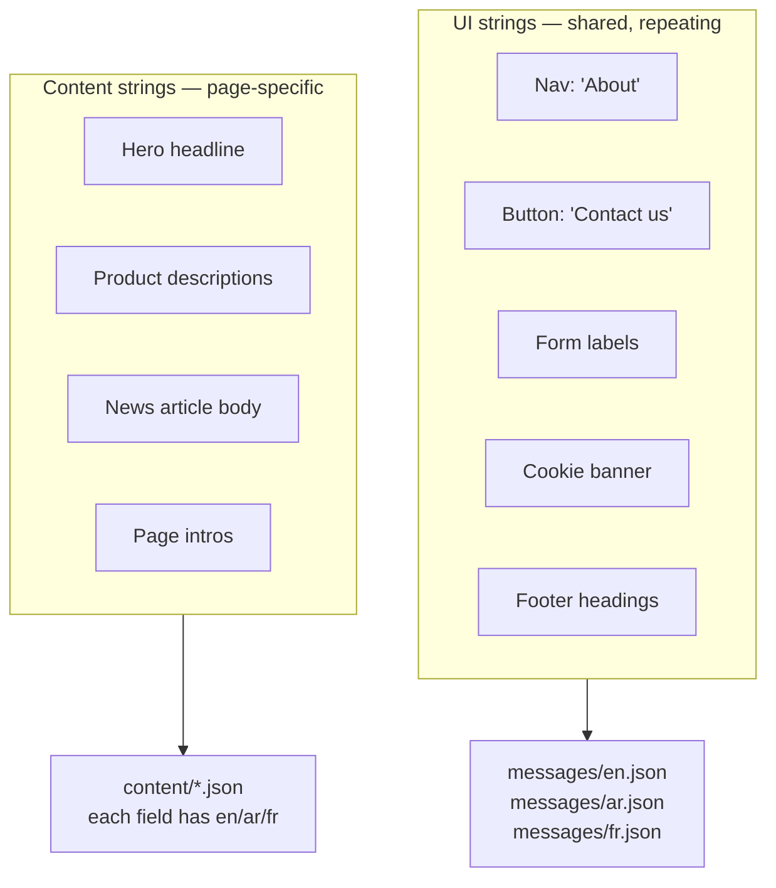

# Update translations

Strings on the site come from **two places**. Knowing which is which saves time.

## Two kinds of text



| If the text is… | It lives in… | Example |
| --- | --- | --- |
| In nav, buttons, form labels, footer, cookie banner, or any other reusable UI element | `messages/en.json`, `messages/ar.json`, `messages/fr.json` | "Contact us" button label |
| Inside a product, news article, or page hero | `content/...json` (each field is `{ en, ar, fr }`) | "Our flagship molokhia" headline |

This guide covers the **UI strings** in `messages/`. For content strings, see [add-product.md](add-product.md), [publish-news-article.md](publish-news-article.md), or [edit-page-content.md](edit-page-content.md).

## Prerequisites

- Git installed; push access to `main`.
- The new string in all three languages (EN / AR / FR).

## Steps

1.  **Open `messages/en.json`** and find the key you want to change. The file is grouped by area:

    ```json
    {
      "nav": {
        "home": "Home",
        "catalog": "Catalog",
        "about": "About",
        "contact": "Contact us"
      },
      "contactForm": {
        "name": "Your name",
        "email": "Email",
        "subjects": { … }
      },
      "cookieBanner": { … }
    }
    ```

2.  **Edit the value** for the key. Keep the key name the same — that's the identifier the code uses.

3.  **Update the matching key** in `messages/ar.json` and `messages/fr.json`. The three files must have the **same keys**; only the values differ. Missing a key in a non-English file means the visitor sees the English string as a fallback.

4.  **Add a new string** _(when adding new UI text from scratch)_: add the same new key to all three files. Coordinate with engineering before doing this — the code has to reference the new key, otherwise it does nothing.

5.  **Validate.**

    ```bash
    npm run content:validate
    ```

    _(The content validator does not currently audit `messages/` for key parity — that's a known gap. Eyeball it: the three files should have the same structure.)_

6.  **Preview locally** _(recommended for any non-trivial change):_

    ```bash
    npm run dev
    ```

    Visit the page where the string appears, and switch languages via the globe icon.

7.  **Commit and push.**

    ```bash
    git add messages/
    git commit -m "i18n: update <area> translations"
    git push origin main
    ```

## Verify

- Switch languages on the live site (globe icon in the header) and confirm the new string shows in each.
- The Arabic side is RTL — text alignment should look correct.

## RTL / Arabic specifics

- Arabic renders right-to-left. The layout automatically mirrors when the locale is `ar`.
- Use **standard Arabic punctuation** — Arabic comma `،`, Arabic question mark `؟`.
- Avoid hard-coded ASCII brackets `(…)` around Arabic text; use the Arabic versions if the text is purely Arabic.
- If a translation contains an English brand name (e.g., "Montana"), wrap it like `<bdi>Montana</bdi>` is **not** needed in JSON — `next-intl` handles bidi when rendering.

## Rollback

```bash
git revert HEAD
git push origin main
```

## Troubleshooting

- **Text doesn't change after push** — Vercel build still running, or browser cache. Hard refresh (`Cmd-Shift-R`).
- **Arabic shows broken characters (`□`)** — File saved with the wrong encoding. Resave as UTF-8.
- **A key shows as literally `nav.home`** — That key is missing from the locale file. Add it.
- **Switching to Arabic shows English in some places** — A key is missing in `messages/ar.json` and falling back to English. Search the en.json key in ar.json and add it.

## Related

- [Edit page content](edit-page-content.md) for page-specific strings.
- [Update legal pages](update-legal-pages.md) — also translated, but kept as Markdown, not JSON.
