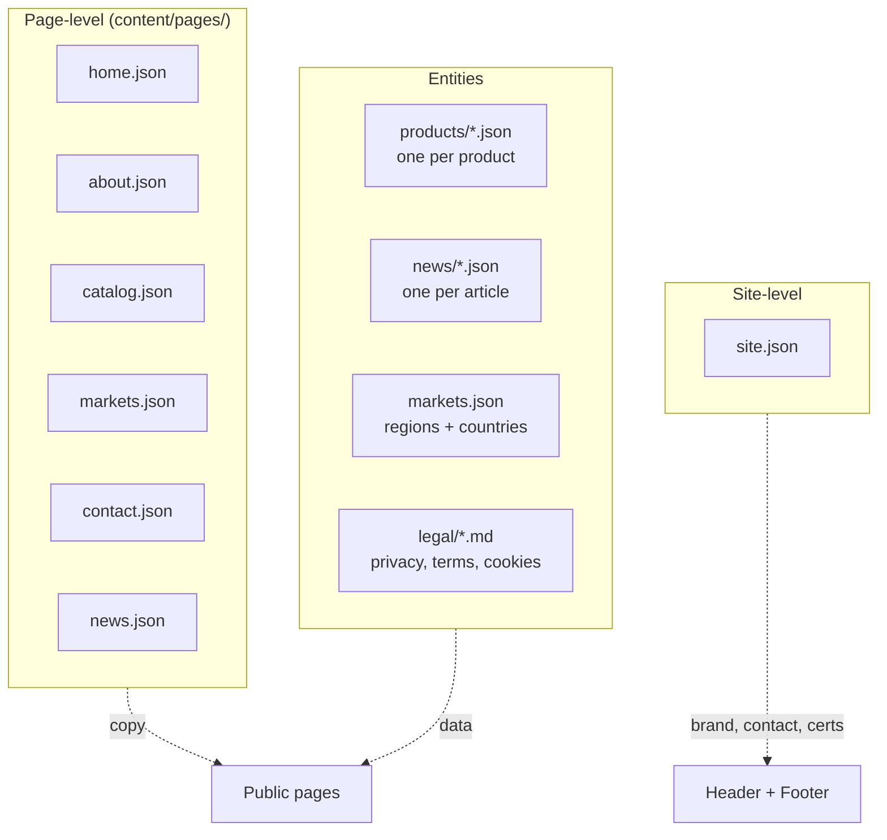

# Content schemas

The exact shape of every content JSON file. The **source of truth** is the zod schemas at `src/schemas/*.ts` — this doc summarizes them. When schemas change, this doc should change too.

## Shared primitives

These appear inside every content file.

### i18nString

A translatable string. English is **required**; Arabic and French are optional but **strongly recommended** — when missing, the page falls back to English.

```json
{ "en": "required",
  "ar": "optional but recommended",
  "fr": "optional but recommended" }
```

### slug

A URL-safe identifier. Lowercase letters, numbers, hyphens only. Examples: `molokhia`, `peas-and-carrots`, `2026-06-launch`.

Pattern: `^[a-z0-9-]+$`

### imagePath

A path to a file in `public/`. Must start with `/`. Must end in `.png`, `.jpg`, `.jpeg`, `.webp`, `.avif`, or `.svg`.

---

## Content files at a glance



---

## Product

File: `content/products/<slug>.json`. Schema: `src/schemas/product.ts`.

| Field | Type | Required | Notes |
| --- | --- | --- | --- |
| `slug` | slug | ✓ | Must match filename. |
| `name` | i18nString | ✓ | Display name. |
| `shortDescription` | i18nString | ✓ | One-liner used on cards and meta-descriptions. |
| `description` | i18nString | ✓ | Full body. Markdown not currently rendered — use plain prose. |
| `category` | enum | ✓ | `vegetable` \| `fruit` \| `leaf` \| `specialty`. |
| `featured` | boolean | ✓ | If `true`, may appear in homepage "Featured products" section. |
| `badges` | array | ✓ | Subset of: `popular`, `seasonal`, `new`, `signature`, `export-only`, `organic`. Empty array allowed. |
| `varieties[]` | array | ✓ | Each: `{ name (i18n), sizes? }`. |
| `varieties[].sizes[]` | array | optional | Each: `{ label (i18n), spec (i18n) }`. |
| `packaging[]` | array | ✓ | Each: `{ sku?, type, weight, perCarton }`. Type is `retail` \| `foodservice` \| `bulk`. |
| `seasonality` | array | ✓ | Subset of `jan`..`dec`. Drives the harvest calendar. |
| `images.primary` | imagePath | ✓ | Card thumbnail and OG image source. |
| `images.gallery[]` | array | ✓ | Lifestyle / in-bowl shots. Empty array allowed. |
| `images.packaging[]` | array | ✓ | Pack photos. Empty array allowed. |
| `nutrition` | i18nString | optional | Free text. Per-100g facts, etc. |
| `preparation` | i18nString | optional | Cooking instructions. |
| `relatedSlugs[]` | array of slug | ✓ | Slugs of products to cross-link. Empty array allowed. |
| `seo.title` / `.description` / `.keywords[]` | optional | optional | Override auto-generated meta tags. |

How to add or edit: [add-product.md](../how-to/add-product.md).

---

## News article

File: `content/news/<YYYY-MM-slug>.json`. Schema: `src/schemas/news.ts`.

| Field | Type | Required | Notes |
| --- | --- | --- | --- |
| `slug` | slug | ✓ | Must match the filename's slug portion. |
| `publishedAt` | `YYYY-MM-DD` | ✓ | Drives sort order. Future dates are NOT auto-hidden. |
| `updatedAt` | `YYYY-MM-DD` | optional | Shown as "Updated …" on the article. |
| `category` | enum | ✓ | `corporate` \| `product` \| `market` \| `sustainability` \| `press`. |
| `featured` | boolean | ✓ | If `true`, may appear higher in the news list. |
| `title` | i18nString | ✓ | |
| `excerpt` | i18nString | ✓ | Shown on the news list and as `og:description`. |
| `body.en` | string | ✓ | Long-form Markdown. |
| `body.ar` / `body.fr` | string | optional | Translations. |
| `author` | string | ✓ | Free text — typically a department ("Communications"). |
| `coverImage` | imagePath | ✓ | 1600 × 900 hero. |
| `tags[]` | array of string | ✓ | Free-text tags. Empty array allowed. |
| `seo.*` | optional | optional | Title / description override. |

How to publish: [publish-news-article.md](../how-to/publish-news-article.md).

---

## Markets

File: `content/markets.json`. Schema: `src/schemas/markets.ts`.

Top-level: `{ regions: [...] }`.

| Field | Type | Required | Notes |
| --- | --- | --- | --- |
| `regions[]` | array | ✓ | One entry per region (EU, GCC, etc.). |
| `regions[].id` | string | ✓ | Internal identifier, lowercase. |
| `regions[].name` | i18nString | ✓ | Display name. |
| `regions[].color` | hex string | optional | Region accent color. Falls back to brand primary. |
| `regions[].leadTime` | string | optional | Shipping window (e.g., `"4–10 days"`). |
| `regions[].lede` | i18nString | optional | Editorial intro for the region card. |
| `regions[].photo` | imagePath | optional | Hero image for the region card. |
| `regions[].countries[]` | array | ✓ | Countries in this region. |
| `regions[].countries[].iso` | 2-char string | ✓ | ISO 3166-1 alpha-2 (`EG`, `FR`, `US`). |
| `regions[].countries[].name` | i18nString | ✓ | Display name. |
| `regions[].countries[].since` | number | optional | Year first shipped to this country. |
| `regions[].countries[].distributor` | string | optional | Distributor name. |

---

## Site-wide settings

File: `content/site.json`. Schema: `src/schemas/site.ts`.

Top-level groups: `brand`, `founded`, `parentCompany`, `parentSince`, `stats`, `contact`, `social`, `certifications`.

| Group | Key fields |
| --- | --- |
| `brand` | `name` (i18n), `tagline` (i18n), `logoUrl`, `logoMarkUrl` |
| `contact.office` | `label`, `address` (both i18n), `phones[]`, `email`, `fax?` |
| `contact.factory` | same as office, plus optional `coordinates { lat, lng }` |
| `social` | `facebook?`, `instagram?`, `linkedin?`, `twitter?`, `youtube?` (all URLs) |
| `certifications[]` | `id`, `name`, `logoUrl?` |
| `stats[]` | `label` (i18n), `value`, `icon?` (lucide icon name) |

---

## Page content files

One file per top-level page. Schema: `src/schemas/page.ts` (every page has its own zod schema in this file).

| Page | File | Schema export |
| --- | --- | --- |
| Home | `content/pages/home.json` | `homePageSchema` |
| About | `content/pages/about.json` | `aboutPageSchema` |
| Catalog | `content/pages/catalog.json` | `catalogPageSchema` |
| Contact | `content/pages/contact.json` | `contactPageSchema` |
| Markets | `content/pages/markets.json` | `marketsPageSchema` |
| News | `content/pages/news.json` | `newsPageSchema` |

**Sections are toggleable** — most have an `enabled: boolean` field. Setting `enabled: false` hides the section without removing its content. Useful for staged launches.

**Recurring shapes** inside page schemas:

- `splitTitle` = `{ lead, em }` — lead text + italic emphasis.
- `splitHeadline` = `{ lead, em, tail? }` — lead + emphasis + optional tail.
- `ctaLink` = `{ label, href, variant?, icon?, external? }`.
- `statItem` = `{ num, sup?, label }` — for "29 markets" stat blocks.
- `seo` = optional per-page SEO override (`title`, `description`, `keywords`, `ogImage`).

To inspect the precise shape of a single page (every field, optional vs required), open `src/schemas/page.ts` and search for the schema name.

How to edit: [edit-page-content.md](../how-to/edit-page-content.md).

---

## Legal pages

Files: `content/legal/{privacy,terms,cookies}.{en,ar,fr}.md`. No schema — plain Markdown.

How to edit: [update-legal-pages.md](../how-to/update-legal-pages.md).

---

## Validation

After any content edit, run:

```bash
npm run content:validate
```

The script (`scripts/validate-content.ts`) loads every file under `content/`, applies the matching zod schema, and prints errors with the exact JSON path of the offending field. Failed validation aborts the build, so a broken file cannot reach production.
