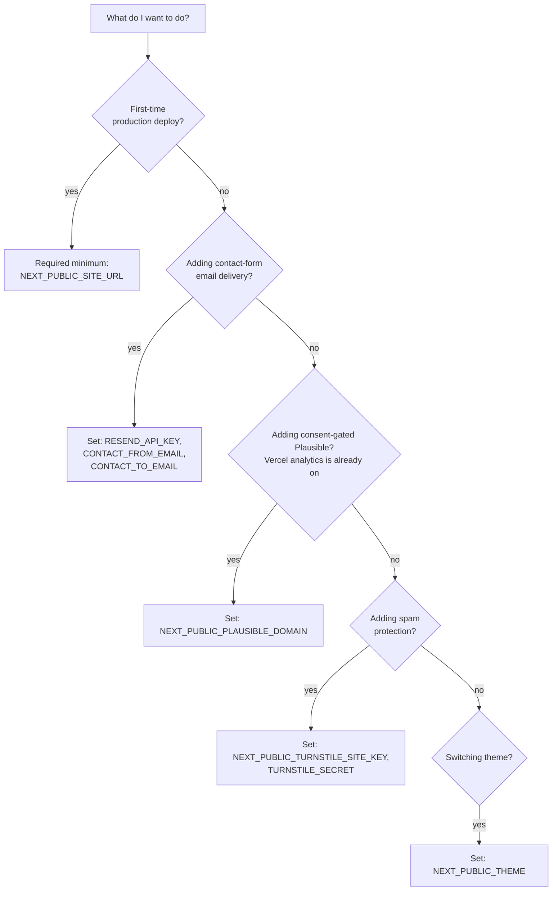

# Environment variables

Every variable, what it does, default, and when you need to set it. Authoritative source: `.env.example` in the repo root.

## Two classes of variable

| Prefix          | Where it ends up                                                         | Use for                                            |
| --------------- | ------------------------------------------------------------------------ | -------------------------------------------------- |
| `NEXT_PUBLIC_…` | Baked into JavaScript sent to every visitor. **Visible in page source.** | Public config — feature flags, theme, public URLs. |
| _(no prefix)_   | Server-only. Used by Next.js API routes. Never reaches the browser.      | Secrets — API keys, tokens.                        |

**Do not put a secret in a `NEXT_PUBLIC_…` variable.**

How to set or change a value: [change-environment-variable.md](../how-to/change-environment-variable.md).

---

## Site identity

| Variable               | Default                 | Purpose                                                                                                                 |
| ---------------------- | ----------------------- | ----------------------------------------------------------------------------------------------------------------------- |
| `NEXT_PUBLIC_SITE_URL` | `http://localhost:3000` | The canonical domain. Used for `og:url`, `robots.txt`, and `sitemap.xml`. Set to `https://montanaeg.com` in production. |

## Theme

| Variable                             | Default   | Purpose                                                                                                                                          |
| ------------------------------------ | --------- | ------------------------------------------------------------------------------------------------------------------------------------------------ |
| `NEXT_PUBLIC_THEME`                  | `default` | Active theme. Valid: `default`, `ramadan`, `christmas`. Invalid values fall back to `default`. See [switch-theme.md](../how-to/switch-theme.md). |
| `NEXT_PUBLIC_THEME_GREETING_ENABLED` | `true`    | Show the seasonal greeting banner on the homepage. Set `false` to hide while keeping seasonal colors.                                            |

## Internationalization

| Variable                        | Default    | Purpose                                                                                                                                                                                 |
| ------------------------------- | ---------- | --------------------------------------------------------------------------------------------------------------------------------------------------------------------------------------- |
| `NEXT_PUBLIC_DEFAULT_LOCALE`    | `en`       | Fallback locale used when the visitor's `Accept-Language` header has no supported match. The root URL `/` redirects to this locale for visitors with no recognized language preference. |
| `NEXT_PUBLIC_AVAILABLE_LOCALES` | `en,ar,fr` | Comma-separated list of locales to expose. Remove `ar` here to disable Arabic site-wide. Also restricts which locales the root-URL redirect (`src/proxy.ts`) will pick from.            |

## Feature flags

| Variable                            | Default   | Purpose                                                                                                                                                                                     |
| ----------------------------------- | --------- | ------------------------------------------------------------------------------------------------------------------------------------------------------------------------------------------- |
| `NEXT_PUBLIC_HIDDEN_PAGES`          | _(empty)_ | Comma-separated page IDs to hide from nav and sitemap. Valid IDs: `home`, `about`, `catalog`, `news`, `markets`, `contact`. See [hide-or-show-a-page.md](../how-to/hide-or-show-a-page.md). |
| `NEXT_PUBLIC_SEARCH_ENABLED`        | `true`    | Enable the product search UI on the catalog page.                                                                                                                                           |
| `NEXT_PUBLIC_NEWSLETTER_ENABLED`    | `false`   | Enable the newsletter signup form in the footer. Requires email-service wiring to actually capture signups (not currently implemented).                                                     |
| `NEXT_PUBLIC_COOKIE_BANNER_ENABLED` | `true`    | Show the cookie-consent banner. Required for GDPR / PDPL compliance — only disable for testing.                                                                                             |

## Analytics

**Vercel Web Analytics is always on.** It is enabled by the `<Analytics/>` component in the root layout (`src/app/layout.tsx`), is cookieless, and needs **no env var** — just keep Web Analytics enabled in the Vercel project. There is nothing to set here for it.

The variables below configure an **optional, consent-gated Plausible** layer on top of that. Leave them empty (the default) and only Vercel Web Analytics runs.

| Variable                           | Default                             | Purpose                                                                                                                                                                                        |
| ---------------------------------- | ----------------------------------- | ---------------------------------------------------------------------------------------------------------------------------------------------------------------------------------------------- |
| `NEXT_PUBLIC_PLAUSIBLE_DOMAIN`     | _(empty)_                           | Plausible analytics domain (e.g., `montanaeg.com`). Leave empty to run with Vercel Web Analytics only. When set, the Plausible tag loads **only after the visitor accepts** the cookie banner. |
| `NEXT_PUBLIC_PLAUSIBLE_SCRIPT_URL` | `https://plausible.io/js/script.js` | Plausible script URL. Override if self-hosting Plausible.                                                                                                                                      |

## Contact form

Server-only — used by the Next.js API route at `src/app/api/contact/route.ts`. See [set-up-contact-form.md](../how-to/set-up-contact-form.md).

| Variable                      | Default                 | Purpose                                                                                                                                                                |
| ----------------------------- | ----------------------- | ---------------------------------------------------------------------------------------------------------------------------------------------------------------------- |
| `RESEND_API_KEY`              | _(empty)_               | Resend API key. **If empty, the form still works** — submissions are logged to Vercel function logs instead of being emailed. Mark as Sensitive when adding to Vercel. |
| `RESEND_REGION`               | `eu-west-1`             | Resend region. Closest to Egypt is `eu-west-1`.                                                                                                                        |
| `CONTACT_FROM_EMAIL`          | `noreply@montanaeg.com` | Sender address. **Must be at a domain verified in your Resend account.**                                                                                               |
| `CONTACT_TO_EMAIL`            | `sales@montanaeg.com`   | Where messages arrive.                                                                                                                                                 |
| `CONTACT_CC_EMAIL`            | _(empty)_               | Optional CC (e.g., a manager).                                                                                                                                         |
| `CONTACT_RATE_LIMIT_PER_HOUR` | `5`                     | Max submissions per IP per hour. _(Enforcement pending — requires KV binding, not currently wired.)_                                                                   |

## Anti-spam (Cloudflare Turnstile)

| Variable                         | Default   | Purpose                                                                                                                                             |
| -------------------------------- | --------- | --------------------------------------------------------------------------------------------------------------------------------------------------- |
| `NEXT_PUBLIC_TURNSTILE_SITE_KEY` | _(empty)_ | Public site key. Get from <https://dash.cloudflare.com/?to=/:account/turnstile>.                                                                    |
| `TURNSTILE_SECRET`               | _(empty)_ | Secret key (server-only). Encrypt. If both Turnstile vars are empty, CAPTCHA verification is skipped — useful for dev, **dangerous in production**. |

## Maps

| Variable                   | Default   | Purpose                                                                                                                                |
| -------------------------- | --------- | -------------------------------------------------------------------------------------------------------------------------------------- |
| `NEXT_PUBLIC_MAP_PROVIDER` | `static`  | `static` uses pre-generated SVG world map (no external calls, zero latency). `maptiler` uses MapTiler tiles (richer, costs API quota). |
| `NEXT_PUBLIC_MAPTILER_KEY` | _(empty)_ | MapTiler API key. Required only if `NEXT_PUBLIC_MAP_PROVIDER=maptiler`.                                                                |
| `NEXT_PUBLIC_FACTORY_LAT`  | `30.2156` | Factory latitude for the markets-page map.                                                                                             |
| `NEXT_PUBLIC_FACTORY_LNG`  | `31.2089` | Factory longitude.                                                                                                                     |

## Maintenance

| Variable              | Default                                     | Purpose                                                                          |
| --------------------- | ------------------------------------------- | -------------------------------------------------------------------------------- |
| `MAINTENANCE_MODE`    | `false`                                     | Reserved for a future maintenance-page feature. Currently not wired into the UI. |
| `MAINTENANCE_MESSAGE` | `"We're upgrading the site. Back shortly."` | Message shown in maintenance mode.                                               |

## Build

| Variable  | Default | Purpose                                                                                         |
| --------- | ------- | ----------------------------------------------------------------------------------------------- |
| `ANALYZE` | `false` | Set `true` to generate bundle-size visualizations during a build (`npm run analyze`). Dev-only. |

---

## "Which vars do I need for…" quick guide

| Goal                                                            | Set these                                                  |
| --------------------------------------------------------------- | ---------------------------------------------------------- |
| **First deploy**                                                | `NEXT_PUBLIC_SITE_URL`                                     |
| **Enable email delivery**                                       | `RESEND_API_KEY`, `CONTACT_FROM_EMAIL`, `CONTACT_TO_EMAIL` |
| **Add consent-gated Plausible** (Vercel analytics is always on) | `NEXT_PUBLIC_PLAUSIBLE_DOMAIN`                             |
| **Enable spam protection**                                      | `NEXT_PUBLIC_TURNSTILE_SITE_KEY`, `TURNSTILE_SECRET`       |
| **Switch theme**                                                | `NEXT_PUBLIC_THEME`                                        |
| **Hide a page temporarily**                                     | `NEXT_PUBLIC_HIDDEN_PAGES`                                 |
| **Disable a locale**                                            | `NEXT_PUBLIC_AVAILABLE_LOCALES`                            |
