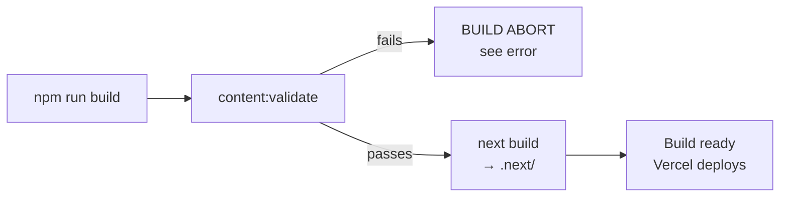

# npm scripts

Every command in `package.json` and when to use it. Run all of these from the `web/` folder.

## Day-to-day (you'll use these often)

| Command | What it does | When to use |
| --- | --- | --- |
| `npm install` | Install / refresh dependencies into `node_modules/`. | First clone; after pulling changes that touch `package.json` or `package-lock.json`. |
| `npm run dev` | Start the Next.js dev server with hot reload at <http://localhost:3000>. | Local development and previewing content edits before pushing. |
| `npm run content:validate` | Validate every JSON file in `content/` against the zod schemas. | Before committing any content change. Catches missing translations, bad field types. |

## Quality checks (run before pushing)

| Command | What it does | When to use |
| --- | --- | --- |
| `npm run lint` | ESLint over the whole codebase. | Before commit. CI runs this; failing means PR cannot merge. |
| `npm run typecheck` | TypeScript type check (`tsc --noEmit`). | Before commit. Faster than full build. |
| `npm test` | Vitest unit tests (zod schema validation across all content). | Before commit. |
| `npm run test:watch` | Vitest in watch mode. | During TDD on schemas. |
| `npm run format` | Auto-format all files with Prettier. | Whenever code looks unformatted. |
| `npm run format:check` | Prettier dry-run; fails if files would change. | CI uses this. |

## Build & local production

| Command | What it does | When to use |
| --- | --- | --- |
| `npm run build` | Production build: validate content → `next build`. Output goes to `.next/`. | Before pushing big changes. CI runs this; Vercel runs this too. |
| `npm start` | Start Next.js in production mode against the local `.next/` build at <http://localhost:3000>. | Local smoke-test of the production build before pushing (rare). |

## E2E tests

| Command | What it does | When to use |
| --- | --- | --- |
| `npm run test:e2e` | Playwright smoke tests against a running prod server. | Before a big release. Requires `npm run build && npm start` running in another terminal. |

## Content & assets

| Command | What it does | When to use |
| --- | --- | --- |
| `npm run content:validate` | Zod-validate every content JSON. | After any content edit. _(Listed above too — high-traffic command.)_ |
| `npm run content:process-images` | Image optimization via sharp (resize, generate AVIF/WebP variants). | When adding raw / unoptimized images to `public/images/`. _(Optional — Next.js / Vercel also optimize at request time.)_ |

## Build analysis

| Command | What it does | When to use |
| --- | --- | --- |
| `npm run analyze` | Build with bundle analyzer; opens a treemap of JS bundle sizes. | Performance investigation. |

## The `npm run build` chain explained

A build failure at step B is **good news** — it means a bad content change was caught before production. See [build-failed-on-vercel.md](../runbooks/build-failed-on-vercel.md).

URL redirects (legacy Qode Superfood URLs → new canonical paths) are declared in `next.config.ts` `redirects()` and are applied by Vercel automatically — there's no separate redirects build step anymore.

## What CI runs

The GitHub Actions workflow at `.github/workflows/ci.yml` runs:

1. `npm ci` _(stricter `npm install`)_
2. `npm run lint`
3. `npm run typecheck`
4. `npm run content:validate`
5. `npm test`
6. `npm run build`
7. `npm run test:e2e` _(after build)_
8. `npm audit` + `gitleaks` _(security)_
9. **Docs link check** — `lychee` over `README.md` and `docs/**/*.md`. Config: [`lychee.toml`](../../lychee.toml). Excludes intentional screenshot placeholders.
10. Lighthouse perf check _(PR only)_

If any step fails, the CI run goes red and the PR cannot merge.

CI is **independent** from Vercel's own build — they each run their own `npm run build`. CI failing won't stop a Vercel deploy (and vice versa). A passing CI on the main branch + a Ready Vercel deployment is the gold standard.
