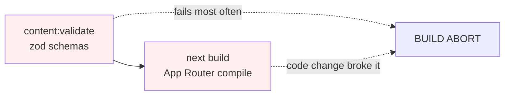
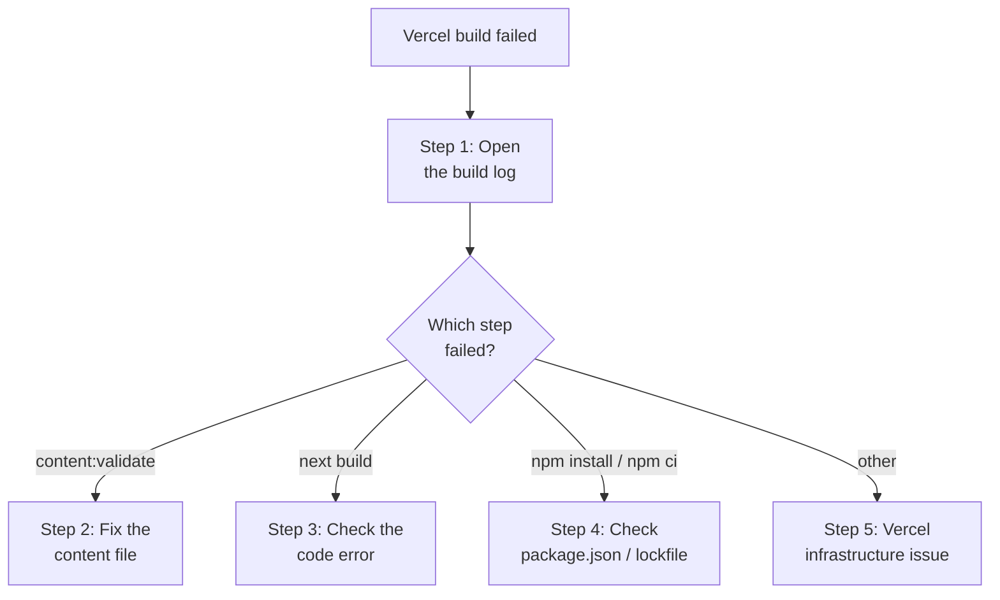
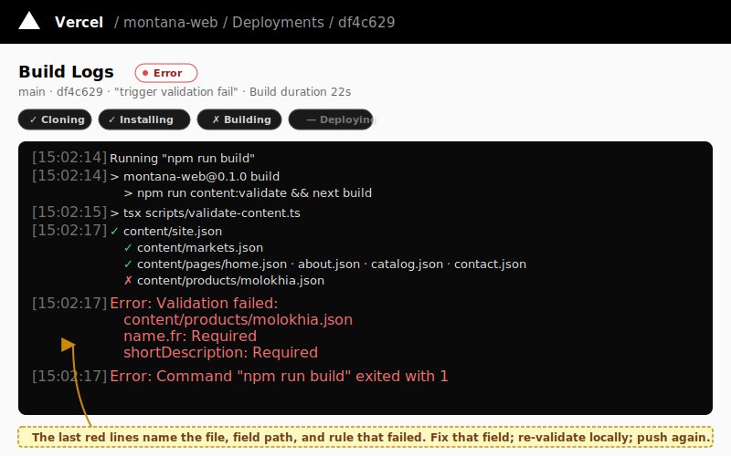

# Runbook — Vercel build failed

**Use this when:** Vercel shows a deployment with status **Error**, and the previous deploy is still serving Production (so the site itself is up).

**Severity:** Medium. The site keeps working; only your latest change isn't live yet.

**Time to first action:** under 5 minutes.

## What happened

Vercel runs `npm run build` on every push to `main`. That command is a chain:



**Most failures are at step 1** — a content file doesn't match its zod schema (missing field, wrong type, bad translation key). The build aborts before Next.js even starts.

The good news: the previous Ready deploy keeps serving as Production. There is no user-facing outage from a failed build. Your job is to fix the issue and push again.

## Decision tree



## Step 1 — Open the build log

1.  **Vercel → your project → Deployments.**

    
    > _Illustration. The Error badge on a row signals a failed build._

2.  Click the **Error** entry at the top of the list.
3.  Click **Build Logs** _(or "View Logs")_.

    
    > _Illustration. The last red lines name the file, the field path, and the rule that failed._

4.  Scroll to the bottom — errors are last. Look for the line starting with `Error:` or a non-zero exit code.

## Step 2 — `content:validate` failed (most common)

Typical error output:

```
Error: Validation failed:
  content/products/molokhia.json
    name.fr: Required
  content/news/2026-06-launch.json
    publishedAt: must be YYYY-MM-DD
```

The error names the **file**, the **field path**, and **what's wrong**.

**Fix:**

1. Open the named file locally.
2. Fix the field. Examples:
   - `Required` → the field is missing; add it.
   - `Invalid enum value, expected X|Y|Z` → use one of the listed values.
   - `must be YYYY-MM-DD` → date format problem; use `2026-06-15`, not `06/15/2026`.
   - `must be kebab-case` → slug has spaces or capitals; use `like-this`.
3. Validate locally:
   ```bash
   npm run content:validate
   ```
   Must pass before you push again.
4. Commit and push:
   ```bash
   git add content/<file>
   git commit -m "content: fix validation for <thing>"
   git push origin main
   ```

The schema for each content type: [content-schemas.md](../reference/content-schemas.md).

## Step 3 — `next build` failed

This is usually a **code** problem (not content). Examples:

- TypeScript compile error.
- Import of a missing module.
- A page tried to use server-only code where client code is expected (or vice versa).

**If you didn't change code**, this should not happen — try **Redeploy** in the Vercel UI (Deployments → three-dot menu → Redeploy). Transient build env issues do exist.

**If you did change code**, fix the error locally:

```bash
npm run build       # reproduce the failure
```

Once `npm run build` passes locally, commit and push.

If you're not a developer and didn't change code, **ask engineering** — don't try to fix code errors blind.

## Step 4 — `npm ci` failed

Error like `EPERM`, `ENOENT`, `Could not resolve dependency`, or `engine "node"`.

**Fix:**

1. Check the Node version Vercel reports matches `package.json` `engines.node` (should be `>=18.18.0`; Vercel defaults to 20.x).
2. If `package-lock.json` changed in the failing commit, the lockfile may be out of sync with `package.json`. Locally:
   ```bash
   rm -rf node_modules package-lock.json
   npm install
   git add package-lock.json
   git commit -m "chore: refresh package-lock"
   git push origin main
   ```
3. If a single package is the problem, the error names it. Sometimes npm registry has a brief outage; **Redeploy** after 5 minutes.

## Step 5 — Vercel infrastructure

If the log shows nothing useful — generic "Build failed", no exit code, or "Container terminated":

1. Check <https://www.vercel-status.com>. Vercel outages do happen.
2. **Redeploy** (Deployments → three-dot menu → Redeploy).
3. If the second attempt also fails with the same opaque error and Vercel status is green, escalate to Vercel support: <https://vercel.com/help>.

## Verify the fix worked

After pushing a fix:

1. Vercel → Deployments — new entry appears within ~10s.
2. Status moves through **Queued → Building → Ready**.
3. The **Production** badge moves to the new deploy.
4. Visit the live site and confirm your change is now visible.

## If you can't fix it right now

If the failing change can wait (it's not urgent) and you're blocked:

1. **Revert your push** so future builds aren't repeatedly failing:
   ```bash
   git revert HEAD
   git push origin main
   ```
   This makes a new commit that undoes the broken one. Vercel will build the revert; that build should succeed (it just removes your change).
2. Investigate the original issue without a red dashboard nagging you.

## Common content-validation errors — quick lookup

| Error message | Fix |
| --- | --- |
| `Required` at path `…name.fr` | Add the missing translation, or copy the English value as a temporary fallback. |
| `Expected string, received undefined` | A required field is missing; add it. |
| `Invalid enum value` | The field accepts only specific values; check [content-schemas.md](../reference/content-schemas.md) for the allowed list. |
| `must be YYYY-MM-DD` | Date format. Use `2026-06-15`. |
| `must be kebab-case` | Slug field; use lowercase letters / numbers / hyphens only. |
| `must be a valid local image path` | Image path must start with `/` and end with `.png`/`.jpg`/`.svg`/`.webp`/`.avif`. |
| `String must contain at least 1 character(s)` | Field is present but empty; add content or remove the field if optional. |

## Related

- [Site is down runbook](site-down.md)
- [Deploy to Vercel](../how-to/deploy-to-vercel.md)
- [Content schemas reference](../reference/content-schemas.md)
- [npm scripts reference](../reference/npm-scripts.md)
