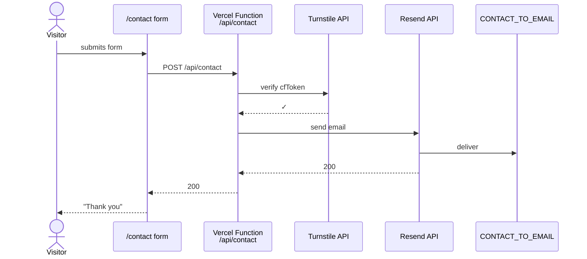
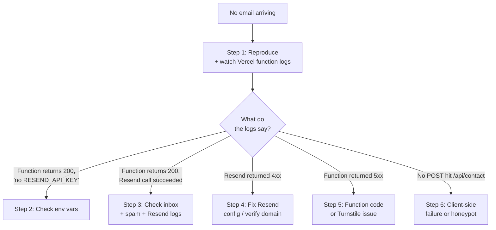
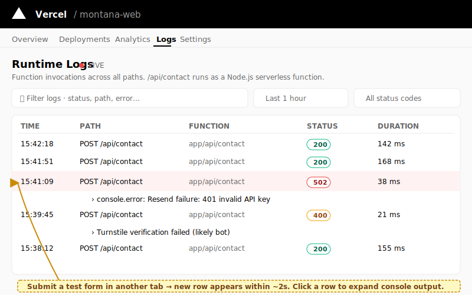

# Runbook — contact form not delivering email

**Use this when:** the contact form on /contact appears to submit successfully (visitor sees "Thank you") but no email arrives at the configured inbox.

**Severity:** Medium-to-high — every missed inquiry is a missed business opportunity.

**Time to first action:** under 5 minutes.

## How it should work

A failure at any arrow shows up as **a 500 in the visitor's browser** OR **a 200 to the visitor but the email never arrives**. The second case is what this runbook is for.

## Decision tree

## Step 1 — Reproduce while watching logs

1.  **Open Vercel → your project → Functions → Real-time Logs.**

    
    > _Illustration. Each row shows time, method, path, status, and duration; click a row to expand the function's console output._

2.  In another tab, open <https://montanaeg.com/contact>.

3.  **Submit a test form** with your own email and a recognizable message (e.g., "RUNBOOK TEST 2026-06-15 14:32").

4.  Watch the log. You should see a request to `/api/contact` and a response code. Note:
    - **Status code** (200 / 4xx / 5xx)
    - Any error message printed
    - Whether the log shows "no RESEND_API_KEY configured — logging submission" (that means env vars are missing)

## Step 2 — Env vars missing or wrong

If the log message says **"no RESEND_API_KEY configured — logging submission"** or you see the submission body printed (it was logged, not emailed):

1.  **Vercel → Settings → Environment variables → Production tab.**
2.  Verify all three are set and non-empty:
    - `RESEND_API_KEY` (encrypted, starts with `re_…`)
    - `CONTACT_FROM_EMAIL` (e.g., `noreply@montanaeg.com`)
    - `CONTACT_TO_EMAIL` (where messages should arrive)
3.  If any is missing, set it. See [set-up-contact-form.md](../how-to/set-up-contact-form.md).
4.  **Retry the deployment** (env-var changes don't auto-rebuild — Deployments → Retry).
5.  Wait for build to finish, then re-test the form.

## Step 3 — Function says success but no email arrived

Function returned 200, log says "Resend call returned 200" — but no email in the inbox.

1.  **Check the spam / junk folder** of `CONTACT_TO_EMAIL`. Resend emails from a noreply address often land here, especially for first-time senders.
2.  **Open Resend dashboard → Emails / Logs.** You should see an entry matching your test submission timestamp.
    - If "Sent" → the email left Resend. The receiving inbox is filtering it. Whitelist `CONTACT_FROM_EMAIL` in the recipient's mail server.
    - If "Bounced" → the destination address is wrong or the mailbox is full. Fix `CONTACT_TO_EMAIL`.
    - If "Complained" → someone marked previous mail as spam. Reputation issue — give it time and stop sending to that address.
3.  **Check the email domain reputation.** If many emails are bouncing, your sender domain may be flagged. Resend → Domains → look for warnings.

## Step 4 — Resend returned 4xx (auth / domain / quota)

Log shows something like `Resend error: 401 Unauthorized` or `403 Forbidden`.

| Error | Fix |
| --- | --- |
| `401 Unauthorized` | API key is wrong or revoked. Generate a new one in Resend → API Keys, update `RESEND_API_KEY` in CF env vars, redeploy. |
| `403 Forbidden — domain not verified` | The domain in `CONTACT_FROM_EMAIL` is not verified at Resend. Go to Resend → Domains → add and verify the domain (DNS records). |
| `403 Forbidden — sending limit reached` | Free-tier quota (3K/month) exhausted. Upgrade Resend plan or wait until next month. |
| `429 Too Many Requests` | Rate-limited by Resend. Wait 1 minute and retry. If recurring, your IP/key is being abused — rotate the key. |

## Step 5 — Function returned 5xx

Generic 500 means the Function itself failed. The log shows a stack trace.

Common causes:

- `TURNSTILE_SECRET` is set but the value is wrong — Turnstile verification fails, function returns 403. Fix: confirm the secret matches the Turnstile site key (Cloudflare dashboard → Turnstile).
- Function code threw an unhandled error. Push a hotfix or revert the last commit.

If you can't tell what's wrong from the log, **escalate to engineering** — share:
- The exact log output
- The time of your test submission
- The deploy SHA currently in production (CF → Deployments → top entry → commit hash)

## Step 6 — Form submits but no /api/contact request

Browser shows "Thank you" but Vercel Functions Real-time Logs shows no incoming POST.

1.  Open your browser **DevTools → Network** tab.
2.  Submit the form again.
3.  Look for a `POST /api/contact` row.
    - If **present, returning 200** but no log on the CF side: caching anomaly. Hard-refresh, try a private window.
    - If **present, returning 4xx/5xx**: the body of the response will tell you why.
    - If **absent**: the form is failing client-side. The honeypot field may be filled in (the form's `website` field should be empty — if a browser extension auto-fills it, the request is silently dropped). Or JavaScript is disabled. Try a different browser.

## Step 7 — Verify the fix worked

1. Submit a fresh test form (new identifiable message — "RUNBOOK TEST RECOVERY <timestamp>").
2. Vercel Functions log shows a 200 response within ~2 seconds.
3. Resend dashboard shows the message as "Sent".
4. The recipient inbox receives the message within ~30 seconds.

## Quick sanity checks (try these first if you're in a hurry)

- Spam folder? _(Step 3.)_
- All three env vars set and the deploy is recent? _(Step 2.)_
- Resend domain verified? _(Step 4.)_

## Related

- [Set up contact form](../how-to/set-up-contact-form.md) — the original configuration guide.
- [Environment variables reference](../reference/env-vars.md) — contact-form section.
- [Site down runbook](site-down.md) — if the whole site is unreachable, not just the form.
