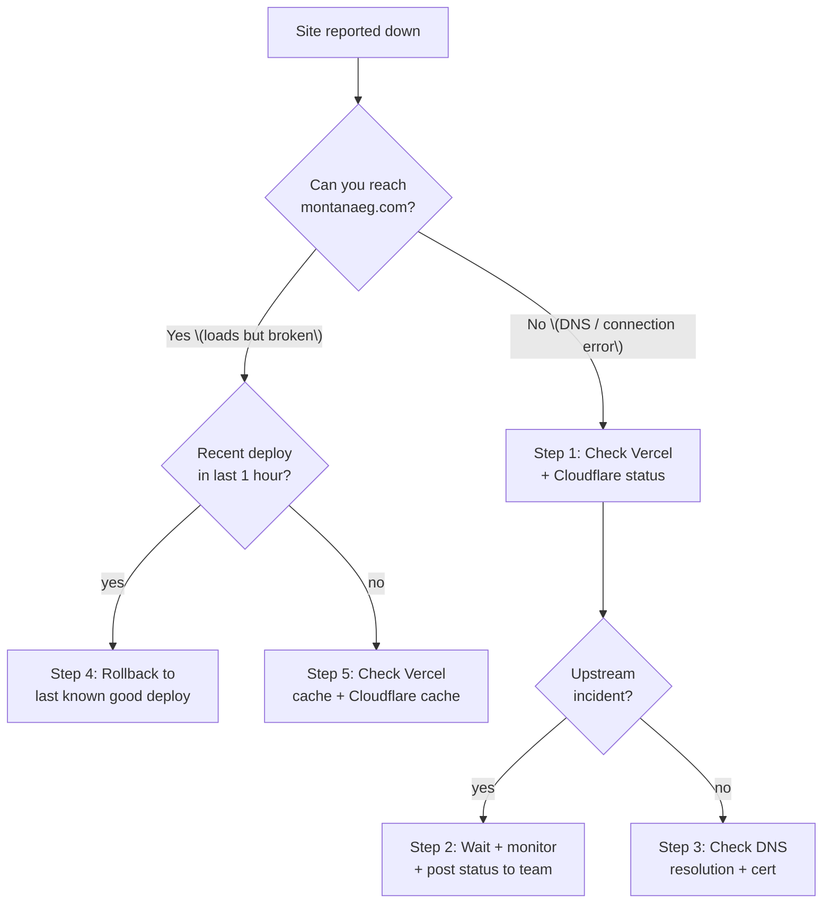

# Runbook — site is down

**Use this when:** visitors can't reach montanaeg.com — page never loads, browser shows "site can't be reached," or the page loads but is wildly broken (blank, error message).

**Time to first action:** under 2 minutes.

**Where your infra lives** _(this matters for triage):_

| Layer | Provider | Status page |
| --- | --- | --- |
| Hosting / build / serverless functions | **Vercel** | <https://www.vercel-status.com> |
| DNS / SSL / Turnstile | **Cloudflare** | <https://www.cloudflarestatus.com> |
| Email delivery (contact form) | **Resend** | <https://status.resend.com> |

An outage can come from any of these. The decision tree below sorts it out.

## Decision tree



## Step 1 — Confirm the outage

1. Open the site yourself in a private/incognito window: <https://montanaeg.com>.
2. Try a second device (phone on cellular, not your Wi-Fi).
3. Open both status pages: <https://www.vercel-status.com> and <https://www.cloudflarestatus.com>.

If only you can't reach it but other devices can, the problem is your network — not the site. Stop here.

## Step 2 — Check upstream provider status

### Vercel (hosting)

If <https://www.vercel-status.com> shows an ongoing incident:

1. Post in the team channel: "Vercel incident ongoing — <link>. Affects montanaeg.com. Monitoring."
2. **You can't do anything but wait.** Vercel incidents typically resolve in 30–90 minutes.
3. Don't push deploys during a Vercel incident — they may queue or fail.
4. When Vercel returns to green, verify the site is back. Hard-refresh.

### Cloudflare (DNS / SSL)

If <https://www.cloudflarestatus.com> shows an ongoing **DNS** or **SSL** incident:

1. Post in the team channel: "Cloudflare DNS incident — <link>. Site may be unreachable. Monitoring."
2. **You can't do anything but wait.** DNS-layer outages are visible globally and resolve quickly.
3. When Cloudflare returns to green, verify the site is back.

_(Cloudflare incidents in Pages or Workers don't affect us — we no longer host on Pages.)_

## Step 3 — Check DNS and SSL

If both providers are healthy but visitors can't resolve the domain:

1. From the terminal:
   ```bash
   dig montanaeg.com
   nslookup montanaeg.com
   ```
2. Expect to see Cloudflare nameservers (`*.ns.cloudflare.com`) and a working A / CNAME record pointing to Vercel.
3. If DNS isn't resolving:
   - Open Cloudflare dashboard → **montanaeg.com** zone → **DNS** tab.
   - Confirm the A / CNAME records exist and point at Vercel.
   - If nameservers have changed at the registrar, this is a registrar issue, not Cloudflare.

For a certificate error (browser shows "your connection is not private"):

1. Vercel → Settings → **Domains** — both `montanaeg.com` and `www.montanaeg.com` should show "Valid Configuration".
2. Cloudflare → zone → **SSL/TLS → Edge Certificates** — the Universal SSL cert should be "Active".
3. Confirm Cloudflare's SSL mode is **Full (strict)** in SSL/TLS Overview, not "Off" or "Flexible".

## Step 4 — Rollback (if a recent deploy is the suspect)

If the site is reachable but visibly broken, and a deploy went out within the last hour:

1.  **Vercel → your project → Deployments.**

    
    > _Illustration of the Deployments view._

2.  Find the **previous Ready** deployment on `main` (above the current Production one).
3.  Three-dot menu → **Promote to Production**.
4.  Confirm. The old build is promoted within **seconds** — already cached at the edge, no rebuild needed.
5.  Verify the site loads correctly. Hard-refresh.

After rollback succeeds:

- Post in the team channel: "Site rolled back to <previous commit sha>. Investigating broken deploy."
- Open the broken deploy's build log and identify the regression.
- Fix in code, push, deploy normally.
- **Do not re-deploy main until the regression is fixed.**

## Step 5 — Edge / cache issues

If everything upstream is healthy, DNS works, and there's been no recent deploy, but the site is broken:

1. **Hard-refresh** in your browser (`Cmd-Shift-R` / `Ctrl-F5`).
2. Try a different browser or private window.
3. **Vercel cache:** Deployments → three-dot menu on the current Production deploy → **Purge Data Cache**.
4. **Cloudflare cache** (if Cloudflare proxying is on): CF dashboard → zone → **Caching → Configuration → Purge Everything**. Wait 1–2 minutes.
5. Re-test.

If cache purges don't fix it, this is likely a deploy issue. Try **Redeploy** in Vercel (Deployments → three-dot → Redeploy → uncheck "Use existing cache").

## Step 6 — Functions / API errors (contact form 500s, etc.)

If pages load but a specific feature returns 500:

1. **Vercel → Logs** (top nav) — filter to `/api/contact`.
2. Reproduce the failing action (submit the form, etc.) and watch the log.
3. Look for the actual error message.
4. See the [contact-form-not-delivering runbook](contact-form-not-delivering.md) if it's the contact form.

## Communicate

While working through this:

- **Post early** in the team channel — even before you have a diagnosis. "Site is down, investigating" is more useful than silence.
- **Update at each milestone** — "Vercel incident, monitoring" / "Rolled back, site is up" / "Root cause: <X>".
- **Note the start time** so post-incident you know how long the outage was.

## Verify recovery

- The site loads at <https://montanaeg.com>.
- Test all three locales: `/`, `/ar`, `/fr`.
- Submit a test contact form (use your own email).
- Check Vercel → Deployments shows the current build as Production.

## Post-incident

Within 24 hours:

1. Write a one-paragraph note in the team channel: what happened, what we did, how long it lasted.
2. If the root cause was a content/deploy regression: update the relevant how-to with the new gotcha so it doesn't bite again.
3. If there's a runbook gap, file an issue or add to this doc.

## Related

- [Build failed on Vercel](build-failed-on-vercel.md)
- [Contact form not delivering](contact-form-not-delivering.md)
- [Deploy to Vercel](../how-to/deploy-to-vercel.md) — rollback procedure detail.
